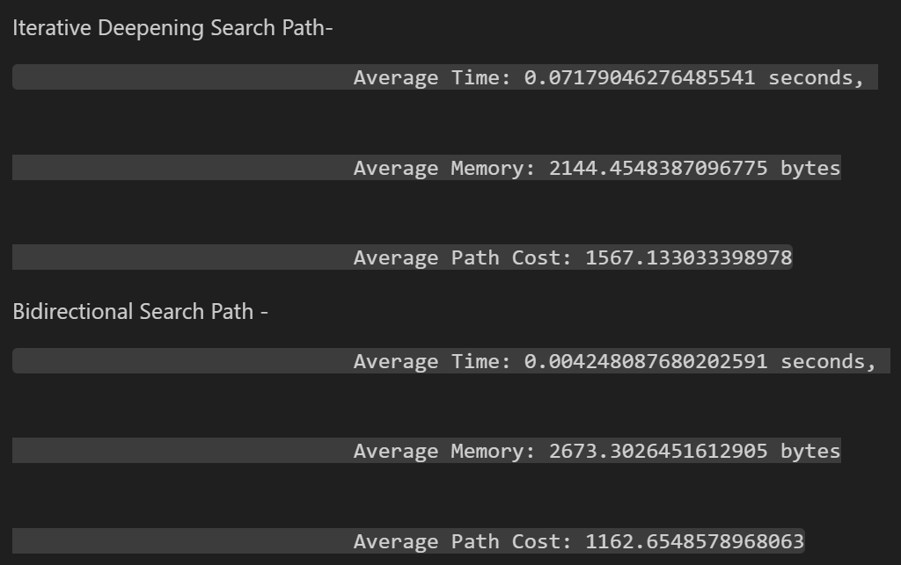
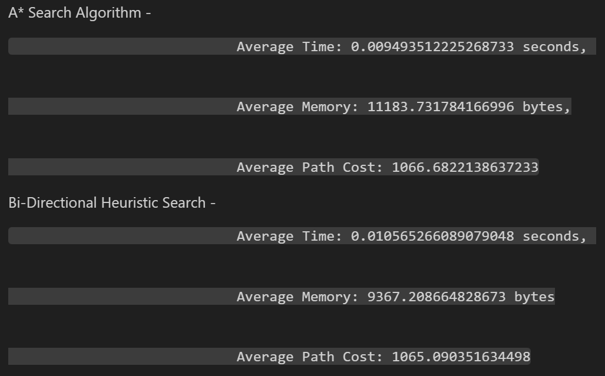
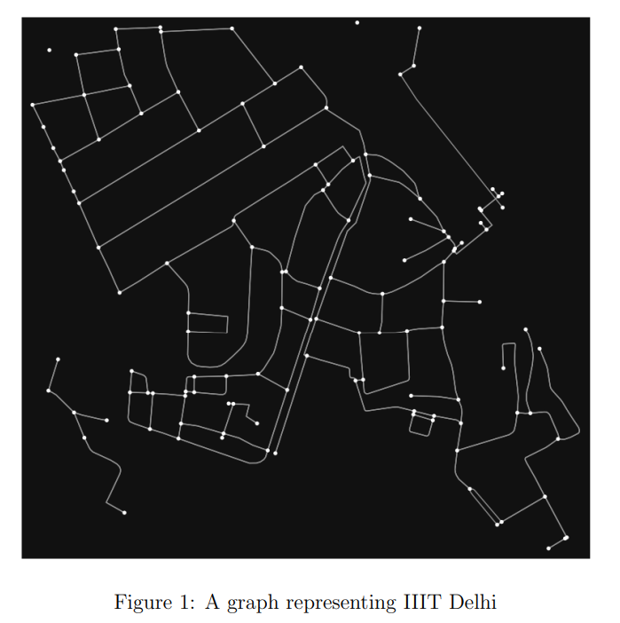
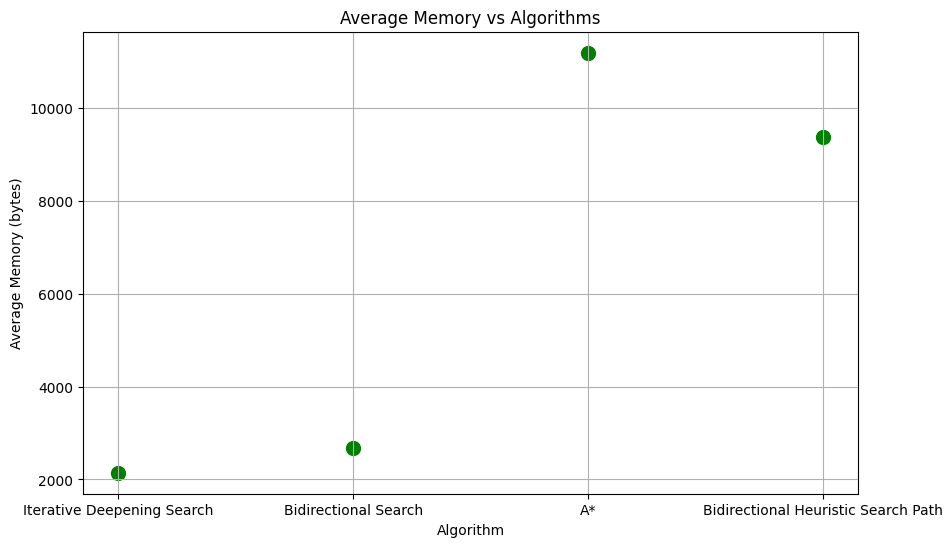
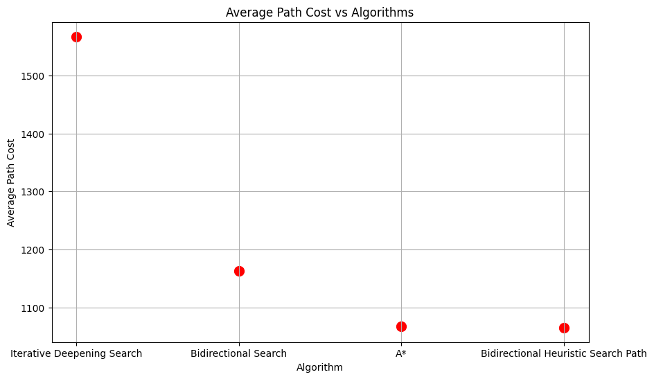

# Graph Search Algorithms: Comparative Analysis

## 📚 **Project Overview**
This project focuses on implementing and analyzing different graph search algorithms to find optimal paths between nodes in a graph. The graph represents a network of geographical locations connected by roads, with costs associated with each connection. The project compares the efficiency, memory usage, and optimality of uninformed and informed search algorithms through empirical analysis and visualization.

---

## 🚀 **Objective**
- Implement key uninformed and informed search algorithms.
- Compare paths, execution time, and memory usage.
- Analyze efficiency and optimality of the algorithms.
- Provide empirical analysis using scatter plots.

---

## 🧠 **Algorithms Implemented**
### **Uninformed Search Algorithms:**
1. **Iterative Deepening Search (IDS)**
2. **Bidirectional Breadth-First Search (Bi-BFS)**

### **Informed Search Algorithms:**
1. **A* Search**
2. **Bidirectional A* Search (Bi-A*)**

---

## 📊 **Analysis and Comparisons**
- Compared the paths obtained from each algorithm.
- Analyzed whether paths are consistently identical or different.
- Measured and compared memory usage and execution time for all pairs of nodes.
- Used scatter plots to visualize space, time efficiency, and cost optimality.
- Provided insights into benefits and drawbacks of informed vs uninformed algorithms.
### **Uninformed Search Algorithms:**

### **Informed Search Algorithms:**

---

## 🗺️ **Dataset**
- The graph is represented as an adjacency matrix.
- Nodes are labeled numerically (0 to n-1).
- Each node is attributed with (x, y) coordinates representing latitude and longitude.

### **Graph Representation**

---

## 📈 **Results Visualization**

- Average Time vs Algorithms

  

- Average Memory vs Algorithms

  

- Average Path Cost vs Algorithms

  

---

## 📝 **Conclusion**
- Observed the trade-offs between space, time efficiency, and path optimality.
- Identified strengths and weaknesses of each search algorithm.

---

## 📬 **Contact**
For questions or collaboration, feel free to reach out!

---

Happy Coding! 🚀

---

*Note: Analysis results are included in the attached files.*

